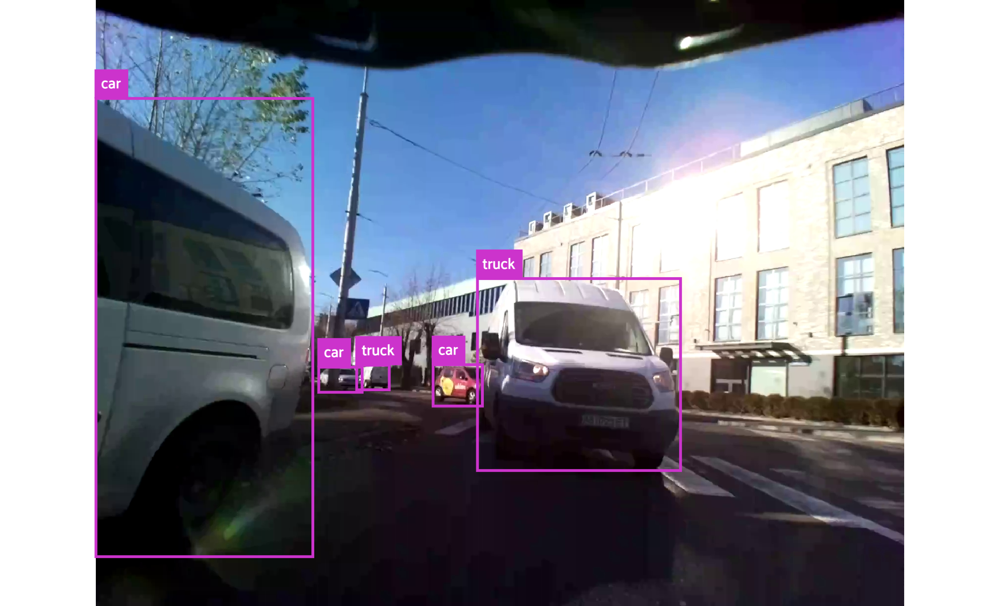
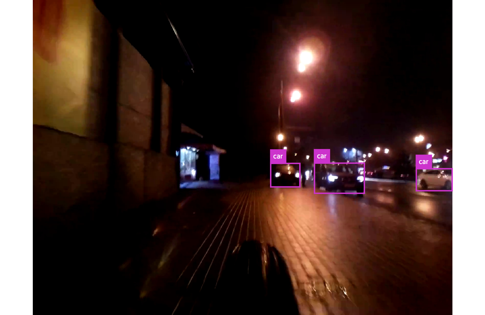

# Rear_view_camera_dataset
A dataset to train object detection models with 

Classes: ["person", "car", "bicycle", "motorcycle", "bus", "truck"]

Dataset has fiftyone COCODetectionDataset format and containts 32448 train images and 3948 validation images

How to start:
1. Download the dataset from google drive (19.4 GB): https://drive.google.com/file/d/1cD-HyTC0Ql60aT673gporro-QUjU1MR7/view?usp=sharing
2. Install requirements:  pip3 install -r requirements.txt
3. Use:

python3 show_dataset.py -p DATASET_FOLDER_PATH    to watch train images

python3 show_dataset.py -p DATASET_FOLDER_PATH -v to watch validation images

I also trained few yolov5 models on 4 datasets: 
    Rear_view_camera (this) + COCO + VOC + BDD100K only with 6 classes ["person", "car", "bicycle", "motorcycle", "bus", "truck"]

Best exxperiments are here:

yolov5s6 1280 with mAP50-95 0.674 https://drive.google.com/file/d/1QcbevmYFB5dprxHUjCiL37eS3UxqBfk9/view?usp=sharing

yolov5s6 640  with mAP50-95 0.634 https://drive.google.com/file/d/1S-YqQeLGLTvLsAdlOC7nyXcZ8VTKCK7g/view?usp=sharing
         
yolov5s6 320  with mAP50-95 0.480 https://drive.google.com/file/d/1gM1z6_0vM8h9BdmrvJUl_v9LyR6ZdU4z/view?usp=sharing
(also compiled to int-8 and edgetpu)

SPECIAL yolov5x6-1536 - I am using it for autolabelling!!!
yolov5x6 1536 with mAP50-95 0.757 https://drive.google.com/file/d/1dlRtrsIRGpI-_F2ew-xuFmugFSa1YLII/view?usp=sharing

Here is a repository which I used to train models:
https://github.com/ultralytics/yolov5

Example from the dataset:

